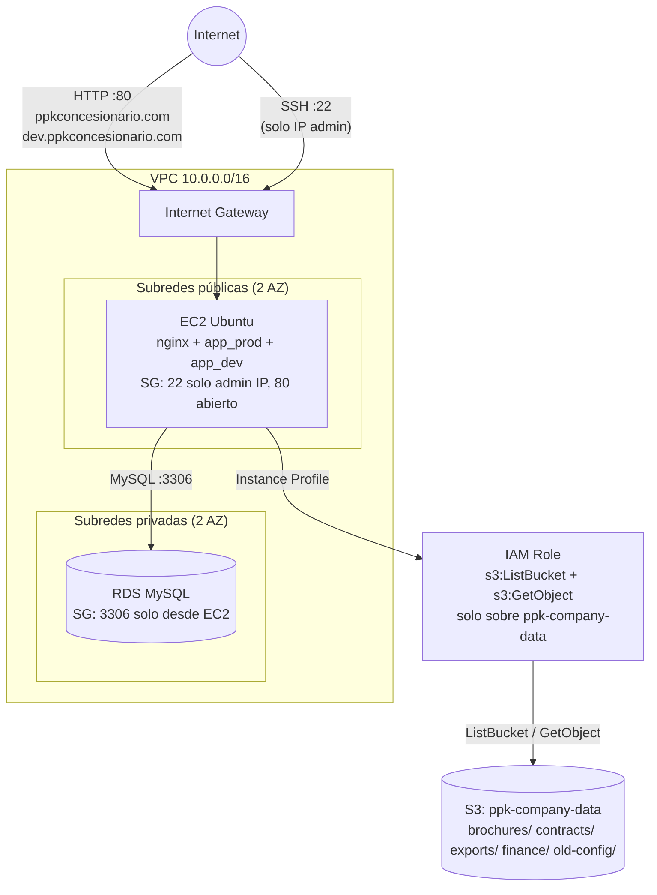

# Arquitectura

## Diagrama de red

No hay Route53, ALB, WAF ni CloudFront. La resolución de nombres la hace el
propio atacante/administrador editando su archivo `hosts` para apuntar
ambos dominios a la IP pública de la instancia; nginx distingue entre
`ppkconcesionario.com` y `dev.ppkconcesionario.com` por cabecera `Host`.

## Recursos AWS y por qué existen

| Recurso | Módulo Terraform | Propósito |
|---|---|---|
| VPC + Internet Gateway | `network` | Red aislada de la cuenta, con salida a internet solo para la subred pública. |
| 2 subredes públicas | `network` | Alojan la EC2 (una sola instancia, en la primera). Dos subredes por buenas prácticas de alta disponibilidad, aunque el laboratorio solo despliega una instancia. |
| 2 subredes privadas | `network` | Requeridas por RDS (necesita un DB Subnet Group con al menos 2 AZ), sin ruta a internet. |
| Route tables | `network` | Tabla pública con ruta a la IGW; tabla privada sin salida a internet. |
| Security Group EC2 | `security_groups` | 22/tcp solo desde `var.allowed_ssh_cidr`; 80/tcp abierto (no hay ALB/WAF delante). |
| Security Group RDS | `security_groups` | 3306/tcp únicamente desde el Security Group de la EC2. |
| EC2 Ubuntu 22.04 | `ec2` | Sirve ambos dominios vía Docker Compose (nginx + 2 contenedores FastAPI). Este es el único host público de la infraestructura. |
| Keypair admin (generado) | `ec2` | Para que el propio operador del laboratorio administre la instancia; no forma parte de la cadena de ataque (que usa SSH por contraseña como `pepe`). |
| RDS MySQL 8.0 | `rds` | Base de datos de la aplicación (vehículos, clientes, solicitudes, usuarios), en subred privada, sin acceso público. |
| IAM Role + Instance Profile | `iam` | Permisos mínimos (`s3:ListBucket`, `s3:GetObject`) sobre el bucket `ppk-company-data`, para que la sección "Documentación comercial" de la app pueda listar folletos. |
| S3 bucket `ppk-company-data` | `s3` | Almacén corporativo compartido: folletos comerciales (uso legítimo de la app) y también contratos, exportaciones de clientes, informes financieros y configuración antigua (uso indebido si se compromete el rol). Bucket privado, sin acceso público. |

## Por qué la instancia puede leer todo el bucket

La aplicación solo necesita listar y leer los objetos bajo el prefijo
`brochures/`. El rol IAM, sin embargo, concede `s3:ListBucket` y
`s3:GetObject` sobre **todo** el bucket (`arn:aws:s3:::ppk-company-data` y
`arn:aws:s3:::ppk-company-data/*`), no solo sobre ese prefijo. Es un error de
alcance muy habitual en despliegues reales: los permisos se piensan a nivel
de bucket, no de prefijo, y con el tiempo el mismo bucket termina alojando
datos de naturaleza muy distinta. Ver
[`docs/vulnerabilities.md`](vulnerabilities.md) para el detalle técnico.
